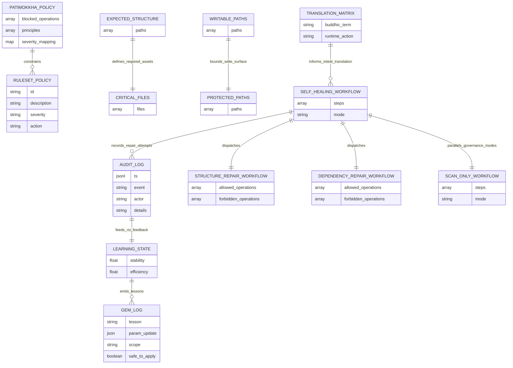

# The Porisjem Protocol (ผู้พิทักษ์แห่งความเงียบ)

PRGX-AG is the backend governance core of **AETHERIUM GENESIS (AGIOpg)**. The repository couples executable Python orchestration with repository-resident policy, manifests, audit state, and workflow definitions so the system can observe, interpret, repair, and learn within bounded safety rules.

## Inspira vs Firma
- **Inspira (เจตจำนง):** constitutional intent, mission, and ethical direction.
- **Firma (โครงสร้าง):** executable implementation that realizes Inspira safely.

The codebase keeps intention, observation, interpretation, execution, ethics, and learning in separate modules to preserve governance boundaries.

## System Architecture Diagram (Database-State Aligned)

The runtime is organized around the `.prgx-ag` data stores. Nexus loads policy and manifests, runs bounded workflows, and persists audit plus learning state back into the repository as durable operational data.



### `.prgx-ag` Data Layout
- **Policies:** `.prgx-ag/policy/patimokkha.yaml`, `.prgx-ag/policy/ruleset.yaml`
- **Translation layer:** `.prgx-ag/translation/aethebud_matrix.yaml`
- **Manifests:** `.prgx-ag/manifests/expected_structure.yaml`, `critical_files.yaml`, `writable_paths.yaml`, `protected_paths.yaml`
- **State:** `.prgx-ag/state/learning_state.json`, `.prgx-ag/state/gem_log.json`
- **Audit trail:** `.prgx-ag/audit/audit_log.jsonl`
- **Execution flows:** `.prgx-ag/workflows/*.yaml`
- **Dependency allowlist:** `.prgx-ag/allowlists/dependency_policy.yaml`

## PRGX Triad
- **PRGX1 Sentry (The Eye):** read-only entropy scanner for dependency, structure, and integrity drift.
- **PRGX3 Diplomat (Brain/Mouth):** translates findings into healing intent and reviewer-facing narrative.
- **PRGX2 Mechanic (The Hand):** the only component allowed to apply explicit fixes.

## AetherBus Topics
- `porisjem.issue_reported`
- `porisjem.intent_translated`
- `porisjem.execute_fix`
- `porisjem.fix_completed`
- `porisjem.audit_violation`
- `porisjem.rsi_feedback`

## Patimokkha Code
The policy layer blocks destructive intent patterns such as `delete_core`, `shutdown_nexus`, exploit behavior, destructive recursion, hidden destructive updates, and unsafe self-modification.

## Healing Cycle
1. PRGX1 detects anomalies.
2. PRGX3 translates findings into healing intent.
3. PRGX2 validates the intent with Patimokkha and executes bounded repairs.
4. PRGX3 publishes a commit-style narrative for human review.
5. RSI derives a bounded GemOfWisdom and applies only safe learning-state updates.

## Local Setup
```bash
python -m venv .venv
source .venv/bin/activate
pip install -e .[dev]
```

## CLI Usage
```bash
python -m prgx_ag.main --once
python -m prgx_ag.main --continuous --interval 10
python -m prgx_ag.main --scan-only
```

## Testing
```bash
pytest
pytest -q tests/test_pipeline_integration.py tests/test_nexus_cycle.py
python -m compileall src
```

### Required release checks
- `python -m compileall src`
- `pytest -q --maxfail=1`
- `pytest -q tests/test_pipeline_integration.py tests/test_nexus_cycle.py --maxfail=1`

## Safety Boundaries
- PRGX1 is strictly read-only and does not write files.
- PRGX2 is the sole write authority and is constrained by allowlist/protected-path controls.
- Patimokkha validation occurs before repair execution.

## English Summary
- Repository health is governed by `.prgx-ag` policies, manifests, workflows, and state.
- Runtime entrypoint: `src/prgx_ag/main.py`.
- Core orchestration: `src/prgx_ag/orchestrator/nexus.py`.
- Repair execution is bounded by policy plus writable/protected path controls.
- The README intentionally omits finished-work suggestion lists so active work is not mixed with archived work.

## สรุประบบภาษาไทย
- สุขภาพของรีโพซิทอรีถูกกำกับด้วยนโยบาย แมนิเฟสต์ เวิร์กโฟลว์ และสถานะใน `.prgx-ag`.
- จุดเริ่มรันไทม์หลักอยู่ที่ `src/prgx_ag/main.py`.
- ตัวประสานงานหลักของระบบอยู่ที่ `src/prgx_ag/orchestrator/nexus.py`.
- การซ่อมแซมถูกจำกัดด้วยนโยบาย Patimokkha และรายการเส้นทางที่อนุญาต/ป้องกันไว้.
- README นี้จงใจไม่เก็บรายการข้อเสนอที่ปิดงานแล้ว เพื่อไม่ให้ปะปนกับงานที่ยังดำเนินอยู่.
